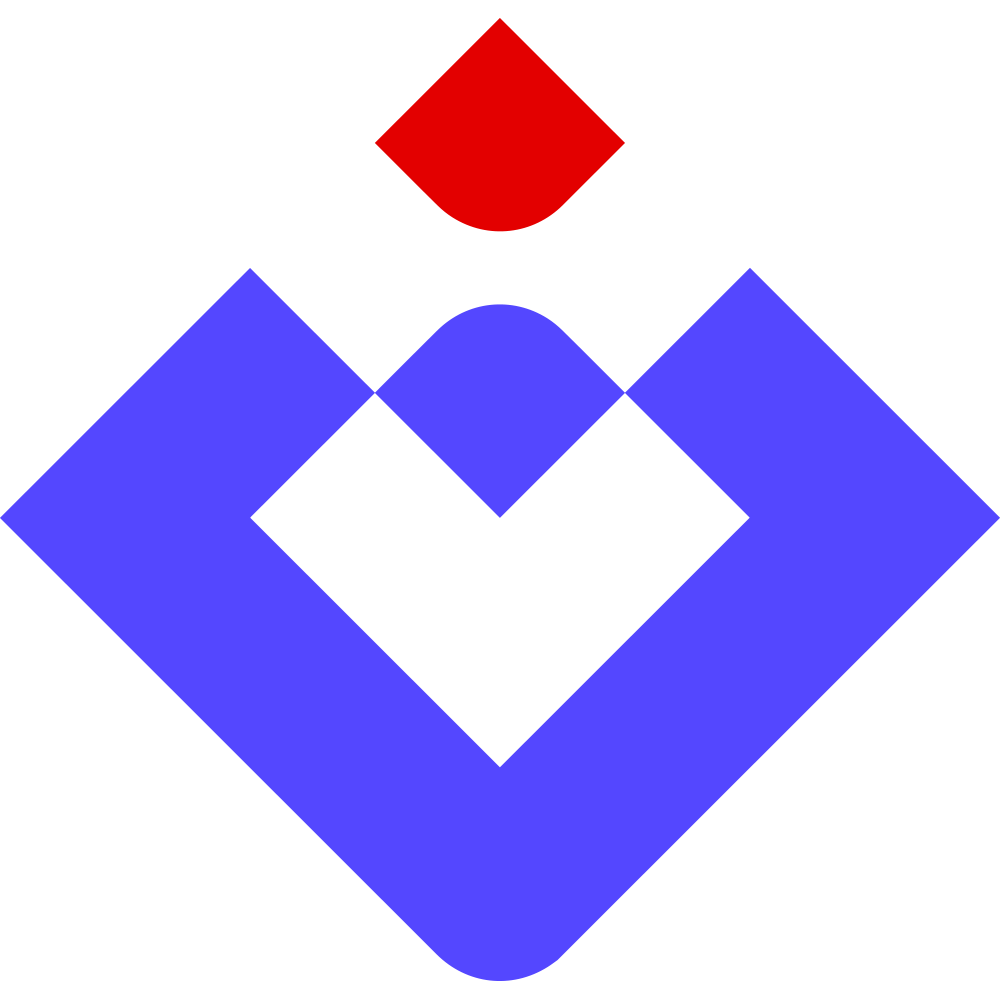

    

    
    
    

    English | <a href="./README.zh_CN.md">中文</a>

---

`gin-template` is an API framework with modular design based on [Gin](https://github.com/gin-gonic/gin). It encapsulates most commonly used functions and is dedicated to rapid business research and development.

This project is designed based on the [project-layout](https://github.com/golang-standards/project-layout) project structure.

After the project is completed, it will be divided into three parts: mini version, basic version, and full version. The mini version only contains basic functions, the basic version includes basic functions, and the full version includes all useful and useless functions.

It may not be possible to conduct a complete online test after completion, so this project is for reference only. If you need to use it online, please conduct a complete online test.
